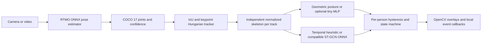

# Local posture and temporal fall detection

An offline, multi-person OpenCV application for Apple Silicon macOS and Windows.
The working default is the official **RTMO-m Body7 COCO-17 ONNX** pose model.
Posture uses confidence-aware geometric rules; fall detection uses a causal
temporal heuristic with per-person history, persistence and a state machine.
**Lying is a posture and does not automatically trigger a fall event.**

This repository provides a working engineering baseline, not a validated medical
alarm. Real fall recall, hard-negative false alarms and crowded tracking still
require representative held-out recordings and evaluation. No fall-trained
ST-GCN++ model is included. No inference calls a cloud service. After installation
and explicit model download, the app runs offline.

## Architecture



Camera capture and inference run in separate threads. The camera retains the
latest frame; inference consumes recent frames at a configurable 10/15/30 FPS
target, avoiding a growing queue. Rendering uses the latest inference result and
discards overlays older than 0.25 seconds or eight captured frames by default.
File processing prefers valid monotonic media timestamps, including VFR input.
OpenCV recordings use the source's nominal constant FPS; VFR timing and audio
are not retained in the output. Posture, fall probability and final state remain
separate throughout the pipeline.

The tracker combines predicted motion, body-relative box-center distance, IoU,
visible-joint distance and reliable scale consistency. Hungarian matches must be
unambiguous on both sides; near ties remain lost and invalidate the affected
motion histories and state latches. IDs are never reused. Short unambiguous
occlusions retain IDs. Reliable rolling medians and a time-based EMA stabilize
each person's body scale when ankles or other joints disappear.

[Hardening details and configuration reference](docs/HARDENING.md) describe the
association gates, temporal confirmation, normalization contract and regression
coverage. These changes are engineering safeguards; no held-out accuracy claim
is made.

## Installation: Apple Silicon macOS

Use native arm64 Python 3.11 or newer. From the repository directory:

```sh
python3.12 -m venv .venv
source .venv/bin/activate
python -m pip install --upgrade pip
python -m pip install -e '.[dev]'
python tools/download_models.py
python tools/check_runtime.py
python -m src.app --camera 0 --config configs/mac.yaml
```

The normal `onnxruntime` wheel exposes CoreML where supported. Auto selection
prefers CoreML, then CPU. Grant camera access to the terminal or Codex host in
System Settings → Privacy & Security → Camera if prompted. Keep the terminal
running while the OpenCV window is open.

## Installation: Windows

PowerShell, from the repository directory:

```powershell
py -3.12 -m venv .venv
.\.venv\Scripts\Activate.ps1
python -m pip install --upgrade pip
python -m pip install -e ".[dev]"
python tools/download_models.py
python tools/check_runtime.py
python -m src.app --camera 0 --config configs/windows.yaml
```

CPU inference works with the default installation. Install **one** ONNX Runtime
distribution for optional acceleration. These distributions share the same Python
module and should not coexist in one environment. Install app/extras first, then
replace the default distribution:

```powershell
python -m pip uninstall -y onnxruntime
python -m pip install onnxruntime-directml
# OR, NVIDIA with compatible CUDA/cuDNN installed:
# python -m pip install onnxruntime-gpu
# OR, a supported Intel GPU/CPU OpenVINO setup:
# python -m pip install onnxruntime-openvino
python tools/check_runtime.py
```

DirectML supports compatible NVIDIA, AMD and Intel DirectX hardware. CUDA is
optional. Review the official [CUDA prerequisites](https://onnxruntime.ai/docs/execution-providers/CUDA-ExecutionProvider.html),
[DirectML requirements](https://onnxruntime.ai/docs/execution-providers/DirectML-ExecutionProvider.html),
and [OpenVINO provider](https://onnxruntime.ai/docs/execution-providers/OpenVINO-ExecutionProvider.html)
for your installed runtime version and device. Windows execution has portable
code and provider tests; this checkout was exercised on macOS hardware.

## Models and downloads

```sh
python tools/download_models.py
python tools/export_models.py inspect models/rtmo_m.onnx
```

The explicit downloader uses an official OpenMMLab URL, verifies complete local
files, records source/license and SHA256 provenance, and accepts a trusted expected
archive checksum using `--sha256`. No published upstream SHA256 was available for
the default archive, so recorded hashes identify the installed files rather than
independently authenticate their first download. Inference never downloads weights.
Large ONNX models and caches are excluded from Git.

RTMO performs detection and pose estimation in one pass. Its input is a 640×640
letterboxed image, regardless of camera resolution. The optional top-down fallback
is RTMPose-m plus a separate official YOLOX-tiny person detector:

```sh
python tools/download_models.py --model rtmpose_bundle
```

The shipped `configs/rtmpose.yaml` selects:

```yaml
pose:
  model: rtmpose_m
  model_path: models/rtmpose_m.onnx
  detector_path: models/yolox_tiny.onnx
```

```sh
python -m src.app --camera 0 --config configs/rtmpose.yaml
```

RTMPose runs once per detected person, so crowd size affects latency. Model layout,
pose export commands, source URLs and licensing are documented in
[models/README.md](models/README.md). Ultralytics is not a dependency.

## Run camera, video, recording or headless

```sh
python -m src.app --camera 0
python -m src.app --video path/to/video.mp4
python -m src.app --video path/to/video.mp4 --output outputs/result.mp4
python -m src.app --camera 0 --headless
python -m src.app --video path/to/video.mp4 --headless --no-realtime
python -m src.app --camera 0 --provider cpu --debug
```

Controls: **q** quit, **p** pause inference (or file playback), **s** save the current annotated
frame under `outputs/`, **d** toggle debug geometry. Headless camera mode runs until
Ctrl+C; `--max-frames 300` makes a bounded smoke run. Camera recording uses the
configured FPS; recording FPS may differ from actual camera delivery if hardware
cannot sustain it. Source video FPS is preserved; original audio is not copied.

Each overlay shows track ID, skeleton, box, **Raw** posture/confidence, **Final
posture** after smoothing, and the combined **State** plus temporal fall status/score.
The status bar shows capture FPS, pose FPS, processing FPS, inference latency,
provider and person count. FALLEN is highlighted in red. Debug view includes torso
angle, box aspect ratio, normalized downward hip velocity, pose quality,
association confidence and body-scale measurement source/quality. Posture
confidence now incorporates geometric rule margins as well as joint quality;
`PostureResult.pose_quality` exposes observed-joint quality separately from
coverage. Debug view also shows group-based visibility: FULL_BODY, LOWER_PARTIAL,
TORSO, UPPER_ONLY or INSUFFICIENT. Reliable shoulders and hips without useful legs
produce `upright_partial`, `bent_partial` or `horizontal_partial`; they do not
claim standing versus sitting. Head/shoulders alone remain insufficient. Rule
memberships overlap near thresholds, with independent per-track classification
hysteresis before state smoothing. No invisible keypoints are fabricated.
See [partial-body behavior and settings](docs/VISIBILITY.md).

## Configuration

`configs/default.yaml` contains all operational defaults and detector thresholds.
`--config custom.yaml` merges an override profile into those defaults. Relative
model/event paths resolve against this repository, so working-directory changes
do not relocate weights. Example:

```yaml
camera:
  index: 0
  width: 1920
  height: 1080
  fps: 30
pose:
  inference_fps: 15
  confidence_threshold: 0.3
tracking:
  max_missing_frames: 0
  max_missing_seconds: 1.0
posture:
  smoothing_frames: 5
fall:
  detector: heuristic
  history_seconds: 2.5
  possible_threshold: 0.55
  confirmed_threshold: 0.80
  possible_confirmation_seconds: 0.08
  fall_confirmation_seconds: 0.20
  recovery_seconds: 3.0
state:
  rearm_seconds: 1.0
runtime:
  provider: auto
```

Tune against your camera viewpoint and held-out falls/hard negatives. Increasing
confirmation and lying-persistence durations reduces brief false alarms but adds
detection latency. Inspect defaults for the geometric thresholds and motion/gap
gates. Standing, sitting, bending, lying and unknown are enabled by default.
Optional squatting/kneeling rules are enabled with
`posture.enable_extra_postures: true`; evaluate those ambiguous 2D poses before
enabling them. Walking is not a separately trained class in the baseline.

## Execution providers and runtime diagnostics

Auto order on macOS: `CoreMLExecutionProvider` → `CPUExecutionProvider`.
Auto order on Windows: `CUDAExecutionProvider` → `DmlExecutionProvider` →
`OpenVINOExecutionProvider` → `CPUExecutionProvider`. Only installed providers
are attempted. Initialization and inference errors retry a subsequent local
provider. DirectML uses sequential execution and disables memory patterns.

```sh
python tools/check_runtime.py
python tools/check_runtime.py --skip-camera --provider cpu
python tools/check_runtime.py --output artifacts/runtime.json
python -m src.app --camera 0 --provider coreml
```

Runtime reports include OS, architecture, Python/OpenCV/ORT versions, available
providers, bounded camera probe, and model input/output shapes. The displayed
provider is the preferred active provider; unsupported graph nodes can still run
on CPU. RTMO defaults to static CoreML partitions with batch fixed to one,
accelerating the backbone while leaving dynamic person-count/NMS outputs on CPU.
This handles empty scenes without attempting zero-sized CoreML tensors. The
original ONNX file is unchanged. CoreML's initial model compilation is
substantially slower than warm inference. See
[CoreML provider documentation](https://onnxruntime.ai/docs/execution-providers/CoreML-ExecutionProvider.html).

## Temporal falls and events

The rapid path combines normalized hip/shoulder descent, torso rotation,
transition to lying/horizontal, available ankle/floor evidence and lying
persistence. A separate conservative slow-collapse path uses 1.2–2.5 seconds of
mostly downward motion, substantial cumulative descent and longer lying
persistence. Strong transitions may begin from bending or low postures. A bed or
sofa transition cannot confirm from horizontal posture alone. When a reliable
origin ankle plane exists, an elevated endpoint still vetoes confirmation even
after ankles disappear. Torso-only observations require stronger consistent
descent/rotation, bounded torso scale changes, settling and longer horizontal
persistence. Without a floor proxy, intentional lying and falls may be
indistinguishable from the same 2D motion.

Short weak-pose intervals suspend motion and confirmation while preserving valid
evidence. Sustained unreliability, clock regression, long valid-pose gaps,
expired tracks or ambiguous association reset that evidence. Confirmation
accumulates valid prediction duration in seconds; weak or absent intervals do
not count. Missing knees/ankles alone do not suspend valid torso analysis. Strong
candidates can remain possible briefly after disappearance, without accruing
confirmation or emitting a fall event. The state machine maintains FALLING,
FALLEN and RECOVERING separately from posture. A person initially lying receives
LYING (or HORIZONTAL_PARTIAL) until temporal fall evidence is present. Stable
UPRIGHT_PARTIAL can support timed recovery and rearming. Heuristic scores are evidence
scores, not calibrated clinical probabilities.

Events append to `outputs/events.jsonl`, including UTC timestamp, source/video
timestamp, track ID, episode ID, confidence and posture. One episode emits one
fall event. Confirmed recovery followed by stable upright rearming permits an
independent second event, even inside the old cooldown interval. A spatial alert
guard conservatively suppresses duplicate alerts after uncertain ID loss; it
does not transfer histories or labels. It applies to new/invalidated IDs when
the original owner is lost, preserving independent continuously tracked people.
Identity and episode continuity cannot be guaranteed through complete occlusion.
Future local integrations use the
same interface:

```python
from src.config import load_config
from src.events import EventBus
from src.pipeline import Pipeline

events = EventBus("outputs/events.jsonl")
events.subscribe(lambda event: print("Local callback:", event))
pipeline = Pipeline(load_config(), event_bus=events)
# pipeline.process(frame_bgr, monotonic_timestamp)
```

## Training posture and fall models

Install optional training dependencies; normal inference needs no PyTorch:

```sh
python -m pip install -e '.[training]'
python training/extract_skeletons.py --input datasets/videos --output datasets/skeletons --annotations datasets/annotations.json
python training/train_posture.py --data datasets/posture --epochs 40 --output models/posture_mlp.pt --export models/posture_mlp.onnx
python training/train_fall.py --data datasets/falls --epochs 50 --output models/fall_temporal.pt --export models/fall_temporal.onnx
```

The posture model is a tiny MLP. The included fall trainer implements a small
graph-temporal baseline with spatial message passing and residual temporal
convolutions; it is **not** a pretrained ST-GCN++ model. The complete ONNX adapter
also accepts compatible externally trained ST-GCN++ exports. Training splits
whole subjects (or sequences without subject annotations), supports joint
noise/dropout, mirror flipping, confidence variation and causal temporal cropping,
and uses skeletons extracted once rather than raw video every epoch.

The learned fall contract is float32 **[N,C,T,V,M] = [1,3,48,17,1]**, with
`window_root_v1`: x/y relative to the **first reliable hip center in the window**,
using one **median reliable torso-plus-leg scale for the entire window**, plus
joint confidence. This retains global root descent. The default window is
2.5 seconds. Posture inputs remain per-frame hip centered. Missing joints/long
gaps have zero confidence; short
gaps are interpolated without extrapolating beyond observed times. Configure
`fall.detector: stgcn`, `fall.model_path`, `fall.sample_count`, `fall.classes`
and `fall.output_kind: logits` or `probabilities` to match the actual export.
Keep the exported `.metadata.json` alongside the ONNX file. Existing fall weights
trained on independently centered frames require retraining; changing a metadata
string cannot make them compatible. The adapter and checkpoint evaluator reject
incompatible declared normalization.
An arbitrary action-recognition model may use different joints, preprocessing
and classes and must be converted before use. Read [training/README.md](training/README.md)
for annotation format, learned posture activation and export instructions.

## Dataset preparation and evaluation

Separate actual falls from hard negatives. Include forward/backward/sideways
falls, collapse, stumble then fall and chair-related falls. Include quick/slow
sitting, bending/tying shoes, kneeling, squatting, lying on bed/sofa, getting into
or out of bed, sitting/getting up from the floor, picking objects up, exercising,
jumping and crawling. Include occlusions, camera distances, clothing and multiple
people. Keep each participant and recording out of other splits; reserve a
held-out test set entirely outside training/validation.

```sh
python training/evaluate.py --mode posture --data datasets/test_posture --checkpoint models/posture_mlp.pt --output outputs/posture_eval.json
python training/evaluate.py --mode fall --data datasets/test_falls --checkpoint models/fall_temporal.pt --output outputs/fall_eval.json
python training/evaluate.py --mode fall --predictions datasets/heldout_predictions.jsonl --output outputs/fall_events_eval.json
```

Reports include posture per-class precision/recall/F1 and confusion matrix; fall
sensitivity, specificity, precision/F1; per-sequence outcomes; alarm episodes;
and detection latency where fall-onset annotations exist. False alarms per hour
require continuous annotated normal exposure; missing time is excluded. Raw
checkpoint evaluation measures model windows, while production detector
evaluation should supply events/decisions after its episode state machine. See the
training guide for the exact evaluation protocol and limitations. Prioritize
fall recall, false alarms on each hard-negative category, then latency.

## Benchmarks and checks

Fresh hardening checks used the existing M5 Pro installation and retained
CoreML. A warmed 60-frame one-person image run measured pose mean **12.19 ms**,
total mean **12.68 ms**, total p95 **13.13 ms**, p99 **13.28 ms** and **78.83 FPS**,
excluding capture/rendering. A 300-frame two-person skeleton-only run measured
total mean **0.76 ms**, p95 **0.82 ms** and **1265 FPS**, excluding pose inference.
A 60-frame headless webcam smoke and a 60-frame annotated video-file smoke also
completed. See `outputs/hardening_validation.json` and the hardening benchmark
JSON files. These verify execution and timing, not real fall accuracy.

```sh
python tools/benchmark.py --synthetic --frames 300
python tools/benchmark.py --image path/to/person.jpg --frames 60 --warmup 5
python tools/benchmark.py --video path/to/video.mp4 --frames 300
python tools/benchmark.py --camera 0 --frames 300
python -m pytest
ruff check .
```

Reports save machine-readable JSON with mean/p50/p95/p99 latency for pose,
tracking, posture, falls and total processing plus FPS. They are synchronous,
unthrottled throughput/latency measurements, excluding rendering and encoding.
Synthetic skeleton mode measures the core pipeline and explicitly excludes pose
inference. A still-image benchmark measures actual model inference but does not
validate action detection or webcam latency. See `artifacts/` and `outputs/`
for verification results obtained in this checkout.

The original baseline measurements below predate hardening. They were obtained
on this **M5 Pro, 24 GB RAM, 18 CPU cores** using native arm64 Python
3.12.14, ONNX Runtime 1.30.0 and OpenCV 4.14.0, with four ORT CPU threads:

| Mode/provider | Measured frames | Pose mean | Total mean | Total p95 | Total p99 | Unthrottled FPS |
|---|---:|---:|---:|---:|---:|---:|
| RTMO-m, CoreML + CPU partitions | 100 | 11.90 ms | 12.12 ms | 12.45 ms | 12.54 ms | 82.48 |
| RTMO-m, CPU | 60 | 75.17 ms | 75.49 ms | 83.14 ms | 101.93 ms | 13.25 |
| Synthetic skeletons, 2 people | 300 | excluded | 0.34 ms | 0.37 ms | 0.42 ms | 2694 |

The first two rows repeat one real person image after ten warmup frames, in
sequential runs; they exclude camera capture, GUI and video encoding. The
synthetic row uses 30 warmup frames and excludes pose inference entirely.
Raw results: `artifacts/benchmark_coreml.json`, `artifacts/benchmark_cpu.json`,
`artifacts/benchmark_synthetic.json`. These rates are latency/throughput evidence,
not live fall accuracy. A 150-frame GUI webcam run completed locally with the
default 15 FPS pose target and CoreML retained; configured camera delivery was
1280×720 at approximately 30 FPS and observed pose inference approximately 14 FPS.
The recorded video-file workflow and 90-frame skeleton extraction were also
exercised. Models for both optional learned trainers were exported on synthetic
fixtures and matched PyTorch logits within 1.5e-8; those smoke weights are not
fall-trained production weights.

The configured 1280×720 camera benchmark measured 60 frames after ten warmup
frames: 29.88 FPS including synchronous capture, pose mean 13.14 ms, processing
mean 13.16 ms and processing p95 15.05 ms. This recording contained **zero
detected people**, so posture/fall classification timing was zero; it verifies
capture and empty-scene inference, not a populated-scene action benchmark.
See `artifacts/benchmark_camera.json` for actual dimensions and observed-person
counts. The separate GUI smoke included a detected partial person.

## Troubleshooting

- **Missing model:** run `python tools/download_models.py`; custom files must match
  the selected adapter's tensor contracts.
- **Camera unavailable:** run runtime diagnostics, enable camera privacy access,
  close competing camera applications, or try `--camera 1`. Use video mode to
  validate inference independently of camera access.
- **No GUI:** run `--headless`; use the non-headless OpenCV wheel for desktop GUI.
- **Accelerator error:** fallback is automatic; force `--provider cpu` to isolate
  model versus device problems. Install only one ORT distribution.
- **Slow startup:** first CoreML compilation is expected; benchmark warmed runs.
- **Partial bodies:** inspect Visibility and Raw in debug mode. Reliable torso
  groups give useful coarse labels; head/shoulders without reliable hips remain
  UNKNOWN. High observed-joint quality alone does not establish body coverage.
  Improve lighting or camera coverage when the root cannot be observed.
- **ID loss while crossing:** this tracker deliberately abstains at near ties.
  Histories are invalidated and IDs may be lost rather than carry uncertain fall
  evidence across people. Complete overlap remains unresolvable without more
  identity information; evaluate crowded recordings before deployment.

## Licensing and remaining limitations

MMPose/RTMO/RTMPose and YOLOX components are sourced from projects carrying
Apache-2.0 licenses. Dataset and media terms remain separate from code licensing;
review the model provenance and your intended use. There is no required
Ultralytics/AGPL component and no cloud inference dependency. Project application
code licensing has not been selected by the repository owner.

The geometric/temporal baseline is viewpoint-dependent. Slow collapses, severe
occlusion, fall outside the frame, an elevated bed/sofa and deliberate rapid
lying can be difficult to distinguish with 2D skeletons. Normalization does not
remove perspective or camera tilt. Learned models need representative data and
threshold calibration; supplied smoke-training artifacts do not establish
accuracy. Windows GPU execution needs testing on actual target devices. No claim
of clinical safety, quantified fall accuracy or crowd identity robustness follows
from unit tests and camera smoke runs.
